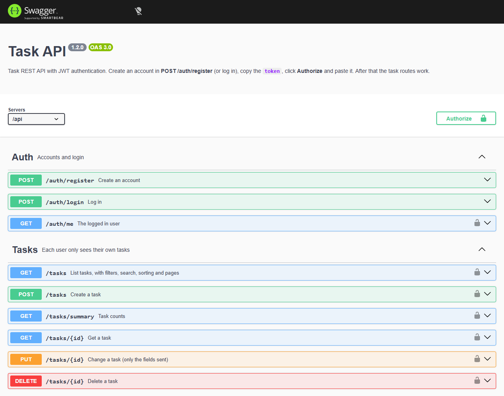

# Task API


A to-do list REST API with sign up and login. Each user only sees their own tasks.

Built with Node.js, Express and PostgreSQL. Login uses JWT and passwords are saved as a hash (bcrypt).

## Running

The easiest way is with Docker, which starts the database along with it:

```bash
docker compose up --build
```

The API runs at http://localhost:3000.

Without Docker, you need Node 18+ and a running PostgreSQL:

```bash
npm install
psql -U postgres -c "CREATE DATABASE tasks_db;"
psql -U postgres -d tasks_db -f config/schema.sql
cp .env.example .env   # and fill in your data
npm run dev
```

## Tests

```bash
npm test
```

The tests start a temporary Postgres on their own (the `embedded-postgres` package), so you don't need the database installed to run them.

## Docs

With the API running, open http://localhost:3000/docs. It's a Swagger UI with every route: create an account, click **Authorize**, paste the token and you can try everything from the browser. The OpenAPI file itself is at `/api/openapi.json`.



A test checks that every route in the router is in the docs, so they don't get out of date when a new route shows up.

## Routes

Login:
- `POST /api/auth/register` creates an account
- `POST /api/auth/login` returns the token
- `GET /api/auth/me` shows the logged in user

Tasks (all of them need the `Authorization: Bearer <token>` header):
- `GET /api/tasks` lists the tasks
- `GET /api/tasks/summary` shows how many are done and how many are pending
- `GET /api/tasks/:id`
- `POST /api/tasks`
- `PUT /api/tasks/:id` (you can send only the field you want to change)
- `DELETE /api/tasks/:id`

The list accepts filters in the URL, for example:

```
GET /api/tasks?completed=false&priority=high&search=study&sort=priority&page=1
```

`sort` can be `recent`, `oldest`, `priority` or `title`.

Sample task:

```json
{
  "title": "Study Node.js",
  "description": "Go over middlewares",
  "priority": "high"
}
```

## Using it

Create the account (the response already has the token):

```bash
curl -X POST localhost:3000/api/auth/register   -H "Content-Type: application/json"   -d '{"name":"Vinicius","email":"vini@email.com","password":"mypassword"}'
```

```json
{
  "user": { "id": 1, "name": "Vinicius", "email": "vini@email.com", "created_at": "2026-10-08T12:53:57.402Z" },
  "token": "eyJhbGciOiJIUzI1NiIsInR5cCI6IkpXVCJ9..."
}
```

Create a task using the token:

```bash
curl -X POST localhost:3000/api/tasks   -H "Authorization: Bearer YOUR_TOKEN"   -H "Content-Type: application/json"   -d '{"title":"Study Node.js","description":"Go over middlewares","priority":"high"}'
```

```json
{
  "id": 1,
  "title": "Study Node.js",
  "description": "Go over middlewares",
  "completed": false,
  "priority": "high",
  "user_id": 1,
  "created_at": "2026-10-08T12:53:57.418Z",
  "updated_at": "2026-10-08T12:53:57.418Z"
}
```

After creating one more and marking it as done, `GET /api/tasks/summary` looks like this:

```json
{ "total": 2, "completed": 1, "pending": 1, "pending_high": 1 }
```

These are real responses, I got them by running the API.

## Some things I took care of

- Every query filters by the `user_id` that comes from the token, so changing the id in the URL won't show you someone else's task (there's a test for that).
- `ORDER BY` never gets text from the user: the `sort` parameter only picks an option from a fixed list.
- In the search, `%` and `_` are treated as text. Without that, searching "100%" returned any task with "100", because they're wildcards in `ILIKE`.
- Login gives the same message for a wrong password and for an email that doesn't exist, and takes the same time in both cases. Otherwise you could find out who has an account by timing the response.
- Register and login accept at most 10 attempts every 15 minutes per IP (`express-rate-limit`), so nobody can brute force passwords.
- A repeated email is blocked by the database `UNIQUE` constraint, not by a `SELECT` before the `INSERT`, which would let two simultaneous requests create the same account.

## Structure

```
src/
  app.js          Express setup
  server.js       starts the server
  routes/         routes
  controllers/    login and task logic
  middleware/     token, id and rate limit checks
  docs/           OpenAPI description used by /docs
config/
  database.js     Postgres connection
  schema.sql      creates the tables
tests/
```
